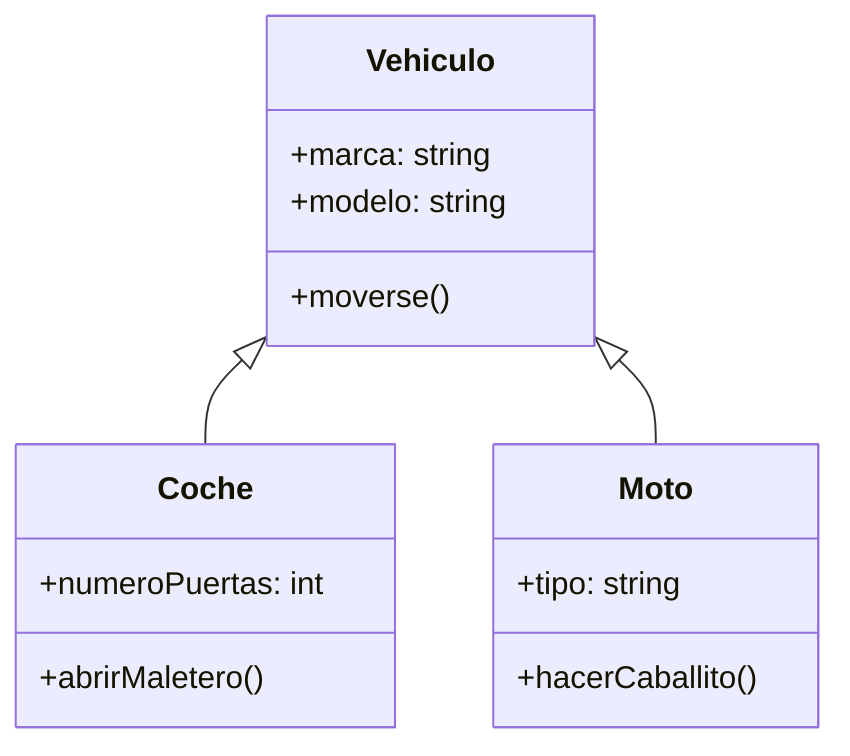
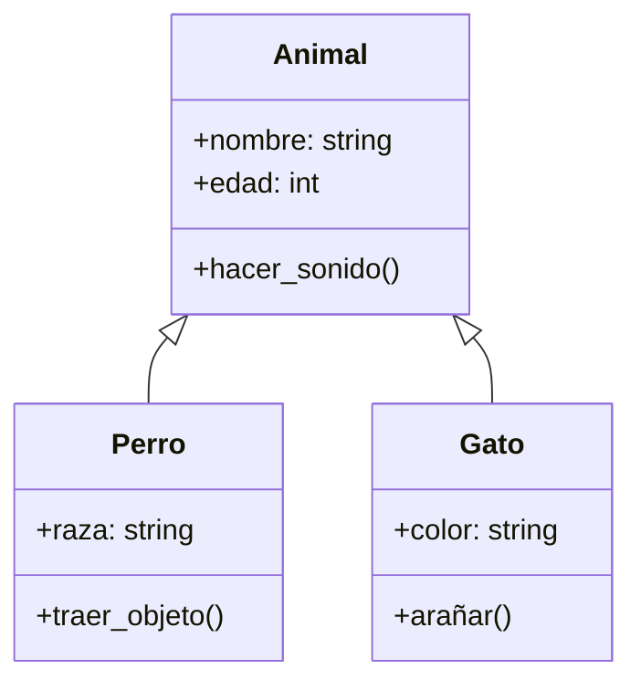

# Algunos diagramas de clases URL

```mermaid
classDiagram
    class Vehiculo {
        +marca: string
        +modelo: string
        +moverse()
    }
    
    class Coche {
        +numeroPuertas: int
        +abrirMaletero()
    }
    
    class Moto {
        +tipo: string
        +hacerCaballito()
    }
    
    Vehiculo <|-- Coche
    Vehiculo <|-- Moto
```

```mermaid
classDiagram
    class Animal {
        +nombre: string
        +edad: int
        +hacer_sonido()
    }
    
    class Perro {
        +raza: string
        +traer_objeto()
    }
    
    class Gato {
        +color: string
        +arañar()
    }
    
    Animal <|-- Perro
    Animal <|-- Gato
```

